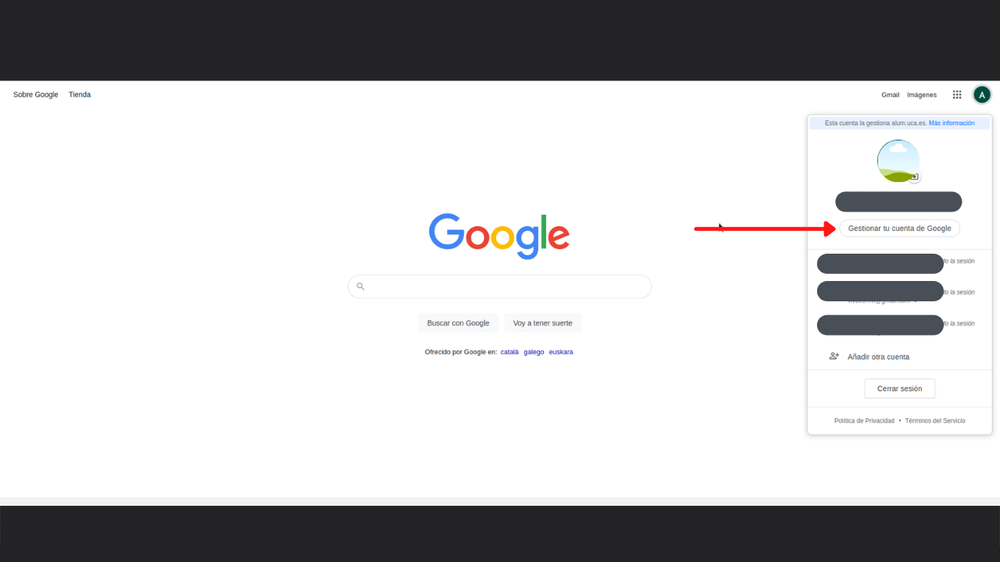
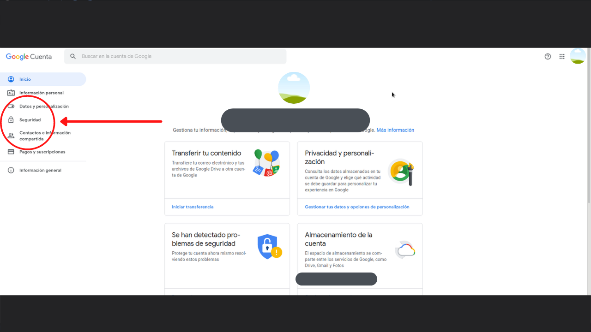
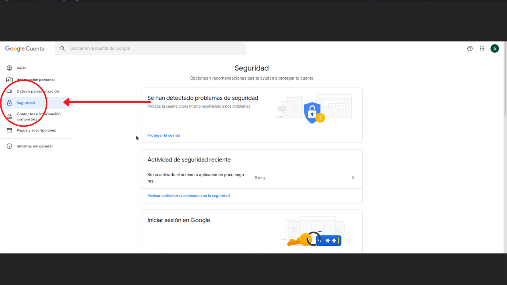
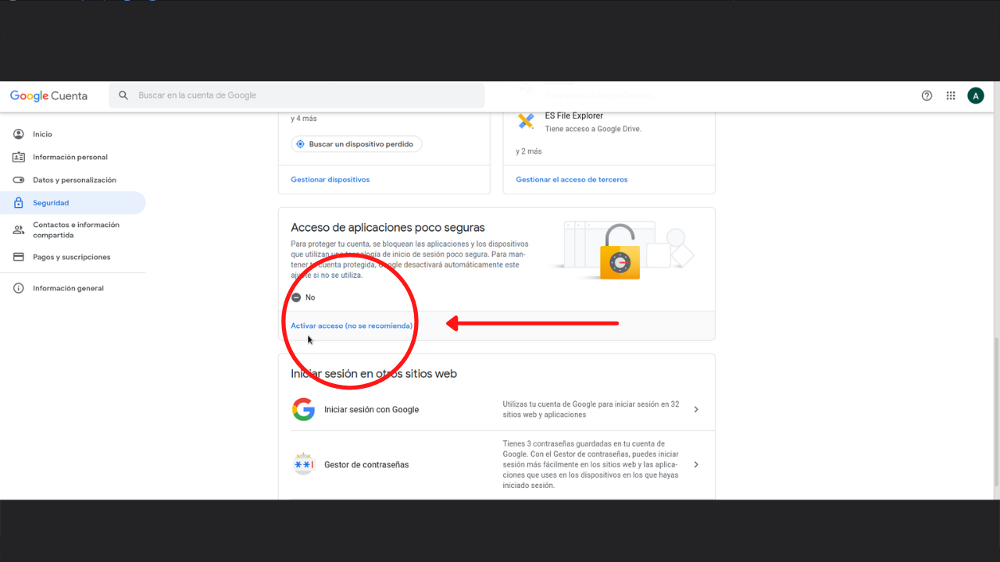

Prerequisitos de la App
===========================

.. toctree::
   :maxdepth: 4

Activación Gmail
^^^^^^^^^^^^^^^^

Primero de todo, debemos permitir que nuestra cuenta de correo Gmail, permita que aplicaciones desconocidas realicen operaciones
sobre la cuenta. Para ello seguiremos estos pasos:

Para poder realizar la API de Gmail, necesitamos activar el “Acceso de aplicaciones poco seguras” en nuestro correo electrónico. 
Para ello, seleccionamos “Gestionar tu cuenta de Google” y, en la pestaña de “Seguridad”, podremos activar dicho acceso.

Paso 1
++++++

Paso 2
++++++

Paso 3
++++++

Paso 4
++++++

